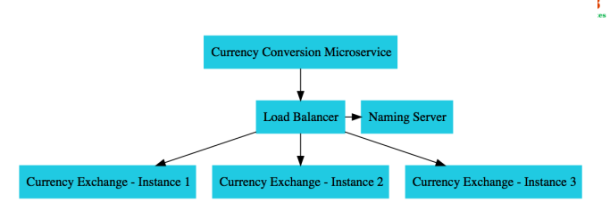

# currency-exchange-microservice
Getting started with Microservices, testing simple microservices with Naming server and Load balancing

source : https://courses.in28minutes.com/p/master-microservices-with-spring-boot-and-spring-cloud
